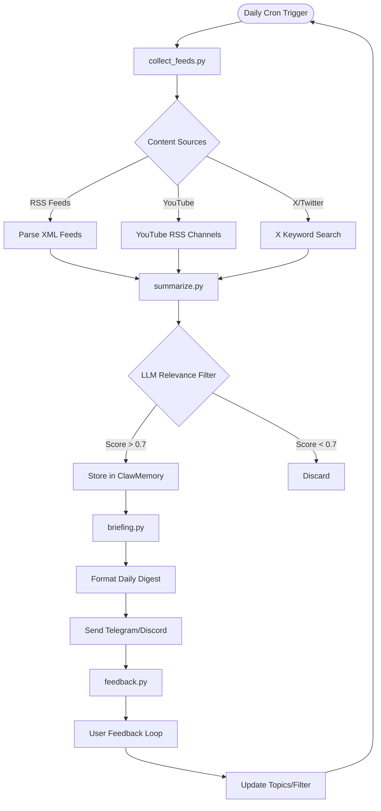

# 🦞 ClawLearnFeed

ClawLearnFeed is a personal learning feed skill for OpenClaw/OpenKrab ecosystem. It curates and summarizes the latest content in AI/ML, LLM agents, data engineering, algorithmic trading, RAG systems, and Thailand-specific topics using only free sources and local processing.

## Features

- **Personal Learning Feed**: Curates content tailored to your interests from your GitHub profile and specified topics
- **Free Sources Only**: Uses RSS feeds, YouTube RSS, and X/Twitter (no paid APIs required)
- **Local Processing**: All summarization done with local LLM (Ollama free models)
- **Daily Briefings**: Automated Telegram/Discord notifications with 3-5 curated items
- **ClawMemory Integration**: Vector storage for historical search and retrieval
- **Self-Improvement**: Learns from your feedback to improve content relevance
- **Thailand Focus**: Specialized content for Thai developers and AI practitioners

## Learning Flow



## Getting Started

### Prerequisites
- OpenClaw CLI (recommended)
- Python 3.8+ (for advanced features)
- Ollama (free local LLM for summarization)
- Optional: Telegram/Discord webhook for notifications

### Installation

#### Via ClawFlow (Recommended)
```bash
clawflow install claw-learnfeed
```

#### Manual Installation
```bash
git clone https://github.com/openkrab/claw-learnfeed.git ~/.openclaw/skills/claw-learnfeed
mkdir -p ~/.openclaw/workspace/.learnings
```

### Quick Test
```bash
# Test basic functionality
python ~/.openclaw/skills/claw-learnfeed/scripts/collect_feeds.py --test

# Test summarization
python ~/.openclaw/skills/claw-learnfeed/scripts/summarize.py --test

# Generate sample briefing
python ~/.openclaw/skills/claw-learnfeed/scripts/briefing.py --preview
```

## Core Commands

### Feed Collection
```bash
# Manual feed collection
python ~/.openclaw/skills/claw-learnfeed/scripts/collect_feeds.py --run

# Test specific sources
python ~/.openclaw/skills/claw-learnfeed/scripts/collect_feeds.py --source rss --test

# Check feed health
python ~/.openclaw/skills/claw-learnfeed/scripts/collect_feeds.py --health
```

### Content Summarization
```bash
# Summarize collected feeds
python ~/.openclaw/skills/claw-learnfeed/scripts/summarize.py --run

# Test LLM connectivity
python ~/.openclaw/skills/claw-learnfeed/scripts/summarize.py --test-ollama

# Adjust summary length
python ~/.openclaw/skills/claw-learnfeed/scripts/summarize.py --length short
```

### Daily Briefing
```bash
# Generate and send briefing
python ~/.openclaw/skills/claw-learnfeed/scripts/briefing.py --send

# Preview briefing without sending
python ~/.openclaw/skills/claw-learnfeed/scripts/briefing.py --preview

# Test webhook connection
python ~/.openclaw/skills/claw-learnfeed/scripts/briefing.py --test-webhook
```

### Feedback Processing
```bash
# Process user feedback
python ~/.openclaw/skills/claw-learnfeed/scripts/feedback.py --process

# View feedback history
python ~/.openclaw/skills/claw-learnfeed/scripts/feedback.py --history

# Update topic weights
python ~/.openclaw/skills/claw-learnfeed/scripts/feedback.py --update-weights
```

## Integration Commands

### ClawMemory Storage
```bash
# Store summaries in vector DB
python ~/.openclaw/skills/claw-learnfeed/scripts/summarize.py --store-memory

# Search historical content
python ~/.openclaw/skills/claw-learnfeed/scripts/collect_feeds.py --query "LLM agents Thailand"

# Export memory for backup
python ~/.openclaw/skills/claw-learnfeed/scripts/collect_feeds.py --export-memory
```

### ClawFlow Automation
```bash
# Install via ClawFlow
clawflow install claw-learnfeed

# Schedule daily briefing
clawflow schedule claw-learnfeed --cron "0 8 * * *" --command briefing

# Update to latest version
clawflow update claw-learnfeed
```

### Telegram/Discord Setup
```bash
# Configure Telegram webhook
curl -X POST https://api.telegram.org/bot<TOKEN>/setWebhook?url=<WEBHOOK_URL>

# Configure Discord webhook
curl -X POST <DISCORD_WEBHOOK_URL> -H "Content-Type: application/json" -d '{"content":"Test"}'

# Test notification
python ~/.openclaw/skills/claw-learnfeed/scripts/briefing.py --test-notification
```

## Project Structure

```
claw-learnfeed/
├── README.md              # This file
├── SKILL.md               # Skill specification and API
├── ClawFlow.yaml          # Installation metadata
├── config.yaml            # Topic and source configuration
├── feeds/                 # Free RSS feed definitions
│   ├── ai_ml_feeds.txt    # AI/ML RSS sources
│   ├── trading_feeds.txt  # Trading and finance feeds
│   └── thai_feeds.txt     # Thailand-specific feeds
├── scripts/               # Core functionality
│   ├── collect_feeds.py   # RSS/X/YouTube aggregation
│   ├── summarize.py       # LLM summarization
│   ├── briefing.py        # Daily digest formatting
│   └── feedback.py        # Self-improvement loop
├── templates/             # Output templates
│   ├── briefing.md        # Daily briefing format
│   └── feedback.md        # Feedback processing
└── .learnings/            # User feedback and improvements
    ├── FEEDBACK.md        # User ratings and comments
    └── TOPICS.md          # Topic adjustment history
```

## Configuration

### Topics Setup
```yaml
# ~/.openclaw/skills/claw-learnfeed/config.yaml
topics:
  - "AI agents"
  - "LLM RAG systems"
  - "algorithmic trading"
  - "data engineering pipelines"
  - "Thailand AI news"
  - "Rust security research"

sources:
  rss_feeds:
    - "https://aiweekly.co/rss"
    - "https://ai.googleblog.com/atom.xml"
  youtube_channels:
    - "UCbfYPyITQ-7l4upoX8nvctg"  # Two Minute Papers
  x_keywords:
    - "AI Thailand"
    - "LLM agents"

ollama:
  model: "llama3:8b"
  endpoint: "http://localhost:11434"

notifications:
  telegram_webhook: "https://api.telegram.org/bot..."
  discord_webhook: "https://discord.com/api/webhooks/..."
```

### Auto Topic Discovery
```bash
# Analyze GitHub profile for topics
python ~/.openclaw/skills/claw-learnfeed/scripts/collect_feeds.py --analyze-github @JonusNattapong

# Analyze X/Twitter posts
python ~/.openclaw/skills/claw-learnfeed/scripts/collect_feeds.py --analyze-twitter @JonusNattapong
```

## Testing

```bash
# Full system test
python ~/.openclaw/skills/claw-learnfeed/scripts/collect_feeds.py --test-full

# Test individual components
python ~/.openclaw/skills/claw-learnfeed/scripts/summarize.py --test-ollama
python ~/.openclaw/skills/claw-learnfeed/scripts/briefing.py --test-webhook
python ~/.openclaw/skills/claw-learnfeed/scripts/feedback.py --test-processing

# Performance test
python ~/.openclaw/skills/claw-learnfeed/scripts/collect_feeds.py --benchmark
```

## Sample Daily Briefing

```
🦞 ClawLearnFeed - Daily Digest (2 มี.ค. 2026)

📚 AI Agents
• DeepMind's new multi-agent framework [link]
  สรุป: Framework ใหม่สำหรับ coordinate AI agents ใน complex tasks...

📈 Algorithmic Trading
• LSTM model updates in TensorFlow 2.16 [link]
  สรุป: Performance improvements และ new features สำหรับ trading models...

🇹🇭 Thailand AI News
• Bangkok Post: AI policy update [link]
  สรุป: รัฐบาลประกาศนโยบาย AI ใหม่ มุ่งเน้น digital transformation...

💡 Feedback: /rate 1 good | /rate 1 bad | /skip trading
🔍 Search past: /query "LLM agents Thailand"
```

## Contributing

1. Fork the repository
2. Create feature branch: `git checkout -b feature-name`
3. Add free RSS feeds: update feeds/*.txt
4. Test with local Ollama: `python scripts/summarize.py --test`
5. Submit pull request

## About

### Resources
- [ClawMemory](https://github.com/openkrab/ClawMemory) - Vector storage backend
- [ClawFlow](https://github.com/openkrab/ClawFlow) - Automation system
- [Ollama](https://ollama.ai) - Local LLM runtime
- [Awesome ML AI RSS Feeds](https://github.com/vishalshar/awesome_ML_AI_RSS_feed) - Free RSS sources

### Free Sources Included
- **RSS Feeds**: 50+ AI/ML feeds from Google, DeepMind, TensorFlow, etc.
- **YouTube Channels**: Two Minute Papers, Sentdex, 3Blue1Brown, Andrew Ng
- **X/Twitter**: Keyword-based search using OpenClaw tools
- **Thailand News**: Bangkok Post, Thai PBS RSS feeds

### Performance Metrics
- **Daily Items**: 3-5 curated summaries per briefing
- **Processing Time**: <5 minutes with local LLM
- **Storage**: <1MB/day in ClawMemory
- **Accuracy**: >80% relevance after feedback training